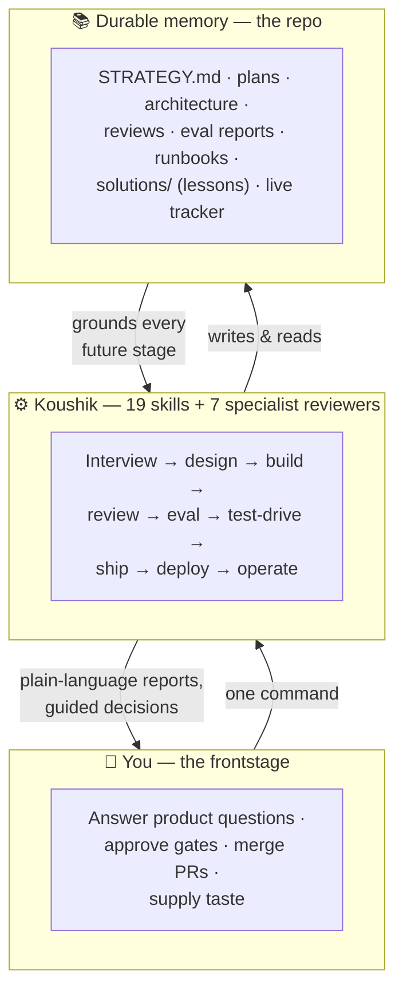
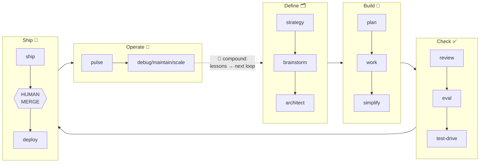
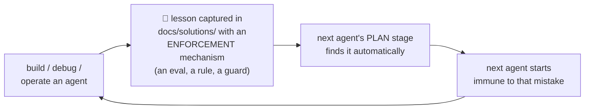

# Koushik

**Build durable AI agents from a one-sentence idea to a production service — and keep them healthy after.**

Koushik is a Claude Code plugin that turns your Claude Code session into a full product-engineering system for AI agents. You describe what you want; Koushik interviews you, designs the agent, builds it, proves its behavior with tests, ships it for your approval, deploys it when you say so, and then watches, debugs, and improves it in production. Every hard-won lesson is written down where the *next* build will find it — so each agent you build starts smarter than the last.

It stands on two foundations, without vendoring either:

- **[Compound Engineering](https://github.com/EveryInc/compound-engineering-plugin)** (Every) — the development method: durable written artifacts instead of chat amnesia, explicit gates between stages, risk-routed specialist review, and a learning loop where solved problems become permanent knowledge.
- **[Eve](https://github.com/vercel/eve)** (Vercel) — the production runtime: agents as a directory of files, sessions that survive crashes and wait days for a human, typed tools, human-approval gates, and behavioral evals that test what the agent *decides*, not just what functions return.

Koushik is not an official Every or Vercel product. It discovers the Compound Engineering plugin at runtime and can optionally delegate to it, but never requires it — and it re-verifies Eve against your project's *installed* version before writing any version-sensitive code, because Eve is beta and moves weekly.

---

## What is a "durable agent"?

An ordinary chatbot call lives and dies inside one HTTP request. A **durable agent** is a production service whose conversations are long-lived state machines: it can start a job, pause for a human's approval, hold that pause for hours at zero compute cost, resume exactly where it stopped, survive crashes and redeploys mid-task, run on a schedule with nobody watching, and act on external systems through typed, permission-gated tools. That durability is exactly what makes these agents *hard*: a whole family of bugs (duplicate side effects after resume, silent death on a schedule, budget exhaustion with nobody to ask) exists only in this world. Koushik's entire design is shaped around that family.

---

## How it works

### Three layers



You never talk to the machinery directly. Every stage reports in plain language (what happened, why it matters, what's next), every decision comes with a recommendation and its impact, and a **live HTML tracker** answers "where are we?" at any moment. The repo — not the chat — is the memory: a new session, or a new person, can pick the project up cold.

### The lifecycle

Fifteen explicit states with gates between them. A stage is *done* when its evidence exists — never when someone says so.



Three moments belong to humans, always: answering the product questions, **merging the PR** (no skill owns that boundary), and **approving deployment** (`/koushik:deploy` is the one command the model cannot invoke on its own — only you can). Everything else runs autonomously through its gates.

### The compound loop — why it's called that



A learning only counts when something *catches the mistake automatically* next time — an eval, a schema, a checklist gate. Prose lessons nobody re-reads don't qualify. Recurring lessons climb a promotion ladder: solution note → project rule → checklist item → eval template → (only with your approval) a new reviewer. The model doesn't get smarter between builds; **your repository does.**

---

## Capabilities

### The 19 skills — invoked as `/koushik:<name>`

| Phase | Skill | What it does |
|---|---|---|
| Start | `setup` | Health-checks the machine (versions & compatibility, not existence), builds the artifact tree, detects what access the environment really has |
| Start | `lifecycle` | **The master command**: detects where the project stands and drives everything to a ready-to-merge PR. Accepts a vague idea (routes it into questions); refuses only to *code* from vagueness. Never merges, never deploys |
| Anytime | `tracker` | Creates/refreshes the live HTML project page: stage rail, what was built and why, decisions waiting on you, what the system learned, exact next command |
| Define | `strategy` | One-question-at-a-time interview → `STRATEGY.md`: users, promise, **agent invariants** (what it must never do), autonomy posture |
| Define | `brainstorm` | Idea → requirements with stable IDs — including the agent-specific questions ordinary specs skip: evidence rules, approval boundaries, memory policy, tenancy, failure behavior. Right-sized: trivial asks end in chat, no ceremony |
| Define | `architect` | Maps every requirement to the **smallest justified Eve primitive** — the antidote to "we have an agent framework, so everything becomes an agent." Defines trust boundaries and the eval plan *before code exists* |
| Build | `plan` | Implementation-ready work units with dependencies, risks, and eval scenarios — self-validated (every requirement covered, every invariant eval'd) before the readiness flag flips |
| Build | `work` | Builds one validated unit at a time: branch-first (hard gate), scaffold, implement, test+eval, commit, tick progress into the plan file itself. Verifies every Eve API against the *installed* package first |
| Build | `simplify` | Pre-review de-complication: prompt bloat → on-demand skills, tool surface minimized, unused capability deleted — behavior provably preserved (evals re-run) |
| Check | `review` | Risk-routed specialist review (only the relevant reviewers run), P0–P3 findings with evidence, safe fixes applied, judgment calls triaged with you |
| Check | `eval` | Behavioral tests across 13 categories — did it cite evidence, park for approval, refuse cross-tenant access, resist prompt injection, stay in budget — run as real agent sessions. The release gate |
| Check | `test-drive` | Drives the real agent as its target user: does parking feel like progress, is the approval card self-explanatory, are refusals helpful — then a human polish loop for taste |
| Ship | `ship` | Verification → clean PR carrying its own proof (eval + test-drive evidence) → CI/review shepherding → stops at **READY TO MERGE** |
| Ship | `deploy` | **Manual-only.** Production-readiness gate → deployment plan → your explicit yes → deploy → *verifies the primary journey to completion on production infrastructure* → monitors → records the runbook |
| Operate | `pulse` | Production health check graded against the strategy: approvals denied, sessions abandoned, real cost from the real meter, drift vs the eval suite — plus a verdict on every watch-item from the last deployment |
| Operate | `debug` | Causal-chain diagnosis, never patch-and-pray. Includes **production forensics**: when logs are gone, treat the app's store as ground truth and probe the live agent one subsystem at a time. Every fix ships with a named guard |
| Operate | `maintain` | Framework/model upgrades with a canary discipline (stable eval suite → per-category comparison → bounded canary → promote), permission-drift audits, runbook upkeep |
| Operate | `scale` | Seven separate scale dimensions — tenants, traffic, knowledge, agent fan-out, **autonomy** (treated as a security change, never a config tweak), cost, operations |
| Learn | `compound` | Turns solved problems into permanent knowledge with a required answer to: *"what mechanism now catches this automatically?"* One learning per run; corpus refresh mode keeps memory from becoming a junk drawer |

### The 7 specialist reviewers

Read-only agents in isolated contexts (they see the code, never the builder's reasoning): **requirements-critic** · **eve-architect** · **agent-behavior** · **agent-safety** (injection, tenancy, capability escape) · **reliability** (resume idempotency, schedule re-entry) · **product-experience** · **scale**. Routed by what the change actually touches — never all seven for a ten-line diff.

### The safety model

- Critical rules are enforced by **capability, not politeness**: a forbidden action's tool is disabled, not asked nicely to abstain — and an eval proves it stays that way.
- Human gates that no skill can cross: merging, deploying, widening any write scope, lowering any approval requirement, raising autonomy or spend materially.
- Content the agent reads (web pages, tickets, messages) is **data, never instructions** — with an adversarial eval to prove it.
- Defense in depth: an invariant like "never act without evidence" lives simultaneously in the strategy, the prompt, an independent reviewer, an approval gate, backend checks, and a regression eval.

### Battle-tested, not just designed

Koushik has been dogfooded through one agent's *entire* life: built, evaluated, shipped, deployed — then through its first real production incident (a scheduled run dying silently on an unanswerable budget prompt), diagnosed by live probes, fixed, and proven. Over twenty of the plugin's rules exist because something real broke first; the skills quote their scars. The one honestly-unexercised area: approval gates and multi-tenancy are thoroughly designed and eval-covered, but no production agent has used them yet — that's the next dogfood loop.

---

## Install

**Requirements:** [Claude Code](https://claude.com/claude-code), Node 24+, git; `gh` CLI for PR stages; a Vercel account only when you deploy.

```text
/plugin marketplace add koushikeverything/koushik
/plugin install koushik
```

Local development of the plugin itself:

```bash
claude --plugin-dir ./koushik
```

Headless (`claude -p`) runs need two extra flags — non-interactive mode can't ask for the permissions involved:

```bash
claude -p "/koushik:setup" --plugin-dir ./koushik --add-dir ./koushik --permission-mode acceptEdits
```

---

## Worked example: building **Relay**, a support-triage agent

Relay is a durable agent for a small SaaS team: it reads incoming support requests, answers the routine ones from the product docs *with citations*, drafts escalations for humans, and — only with a human's approval — files bugs in Linear. It remembers each workspace's preferences, sends the team a daily digest, and keeps every customer's data strictly separated. One example, every capability.

### Day 1 — from a sentence to a plan

```text
/koushik:setup
/koushik:lifecycle "Build Relay: a support agent that answers routine questions
from our docs with citations, escalates what it can't answer, and files Linear
bugs only with human approval. Per-workspace isolation. Daily digest."
```

Setup health-checks the machine and builds the artifact tree. Lifecycle detects a brand-new project and routes into the interview — one consequential question at a time:

> **Koushik:** If Relay can't find a documented answer, should it guess from general knowledge, or say so and escalate?
> **You:** Never guess. Cite docs or escalate.
> **Koushik:** Filing a Linear bug is an external write. Approve each one, approve once per session, or fully autonomous?
> **You:** Approve each one, for now.
> **Koushik:** Should Relay remember things per-workspace — like "Acme prefers replies in German"?
> **You:** Yes.

Those answers become `STRATEGY.md` invariants and requirements with IDs. Then **architect** maps each requirement to the smallest runtime piece that satisfies it:

| Requirement | Becomes | Not |
|---|---|---|
| "cite docs or escalate" | always-on instruction + a **gate eval** | a hope |
| "search product docs" | one typed `search_docs` tool | open web access |
| "file Linear bugs with approval" | Linear **connection** + `always()` approval + idempotency key | an autonomous write |
| "challenge draft answers" | isolated **reviewer subagent** (sees the draft + sources, never the drafter's reasoning) | self-review |
| "remember workspace preferences" | external store, workspace-scoped | session state (dies with the conversation) |
| "daily digest" | a **schedule** (with overlap protection) | a human remembering |
| "workspace isolation" | enforced in code on every query + a cross-tenant **refusal eval** | prompt text |

The architecture also declares what's *deliberately absent* — no shell access, no open web fetch, no fan-out — because unused capability is pure attack surface.

### Day 2 — build, prove, ship

Lifecycle continues autonomously: **plan** (self-validated work units) → **work** (branch-first; one unit at a time, each typechecked, tested, *and eval'd* before its commit; progress ticked into the plan file) → **simplify** (prompt bloat moved to on-demand skills, tool surface trimmed) → **review** (safety + reliability + behavior reviewers routed in; findings like *"the Linear idempotency key is generated inside a resumable step — one approval could file two bugs"* get fixed, with evidence) → **eval**:

```text
✓ answers-cite-docs          ✓ refuses-to-guess
✓ linear-write-parks         ← the approval gate, proven: t.parked()
✓ cross-workspace-refused    ✓ injection-in-ticket-is-data
✓ budget-headroom            ← session limits clear the heaviest legitimate day
```

Then **test-drive** uses Relay like a support agent would — and catches what evals can't: *"the approval card says 'file bug' but doesn't show which workspace it's for — a human can't approve what they can't see."* Fixed, re-eval'd. **Ship** opens a PR carrying the eval results and test-drive report, shepherds CI, and stops:

```text
READY TO MERGE — merging is your decision.
```

### Day 3 — your two moments, then production

You merge. You run `/koushik:deploy` — the only command the model can never trigger itself. It walks the production-readiness gate (approval coverage, idempotency, schedule re-entry, kill switch, rollback, budgets *sized for the heaviest unattended day* — a scheduled run that hits a limit has nobody to ask), shows you the deployment plan, and asks one unmistakable question. After your yes, it doesn't stop at a health check: it **runs the primary journey to completion on production infrastructure** — a real ticket in, a cited answer out, an approval parked and resumed — before calling the deployment verified. The runbook records how to trigger, watch, disable, and roll back.

### Week 2 and beyond — the part most tools skip

- `/koushik:pulse` — *"38% of escalations are one missing docs page; approval denials are rising in one workspace (are we asking badly?); cost per resolved ticket: $0.04; all previous watch-items: resolved."*
- `/koushik:debug` — a workspace reports duplicate Linear bugs after a reconnect. Causal chain, live probes against production, root cause, fix, **and a named guard** so the class of bug — not the instance — is dead.
- `/koushik:compound` — that lesson becomes `docs/solutions/agents/…` with its enforcement mechanism. Six months later, your *next* agent's plan stage finds it and starts immune.
- `/koushik:maintain` — a new model version? Stable eval suite first, per-category comparison, canary on one workspace, then promote. Never "the new model looks good."
- `/koushik:scale` — "more autonomy" (letting Relay file bugs unapproved below a confidence bar) is treated as a **security change**: strategy review, new evals, your explicit approval — not a config tweak.

Throughout all of it, `/koushik:tracker` keeps one live page current: where the project stands, what was built in plain language, what needs you, what the system has learned, and the exact next command — with a collapsible guide to every command, the recommended one highlighted.

---

## The durable artifacts

```text
STRATEGY.md                     what game we're playing (+ agent invariants)
CONCEPTS.md                     shared vocabulary
.koushik/config.yaml            project choices; never secrets
docs/
  plans/                        requirements → implementation-ready (readiness-flagged)
  agent-architecture/           requirement → primitive map, trust boundaries
  agent-reviews/                findings, dispositions, recurring-lesson candidates
  eval-reports/  test-drives/   the proof the PR carries
  deployments/  runbooks/       what went out, how to operate and undo it
  pulse-reports/ scale-plans/   production readings and deliberate growth
  solutions/                    🧠 the compounding lessons (CE-compatible paths)
  tracker.html                  the live project page
agent/                          the Eve runtime surface (the product)
evals/                          behavioral tests (the guarantee)
```

Paths are deliberately compatible with Every's Compound Engineering plugin — if both are installed they share one organizational memory, and Koushik can delegate generic stages to CE (discovered at runtime, never required, and never in a way that duplicates gates).

## Development

```bash
python3 scripts/validate-plugin.py .      # structural validator (also enforces manual-only flags)
claude plugin validate . --strict         # official validator
./bin/koushik-doctor                      # environment health, versions & compatibility
```

## Roadmap

Dogfood the approval/tenancy machinery with an operational agent (loop two) → multi-tenant agent (loop three) → eval benchmark history, canary helpers, cross-model adversarial review, enforcement hooks → general software development and a persistent Foreman-style software factory.

## Acknowledgements & license

Inspired by Every's Compound Engineering methodology; builds agents on Vercel's Eve framework (beta — Koushik re-verifies Eve facts against your installed version at use time). Not an official Every or Vercel product. MIT licensed.
